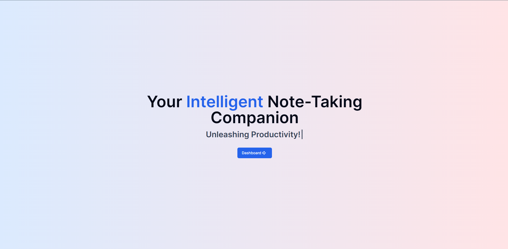
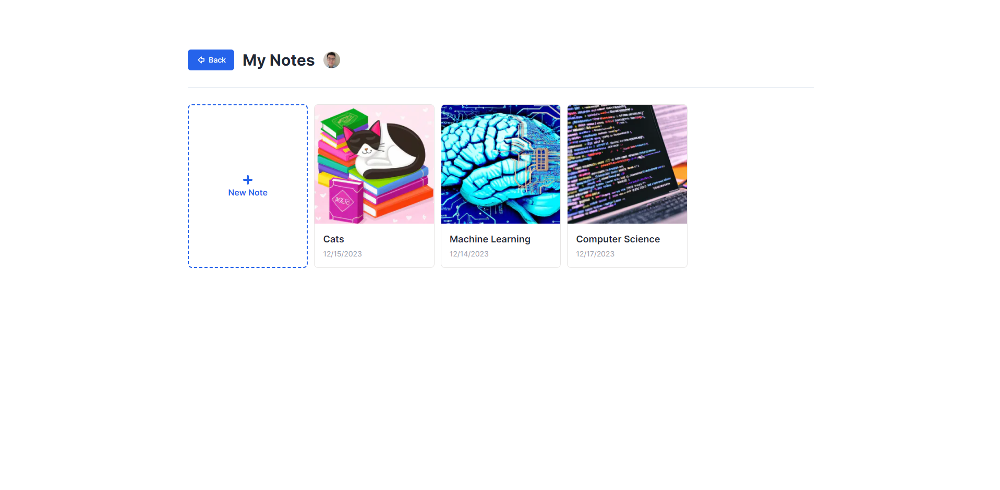

<!-- PROJECT LOGO -->
 

  

<h3 align="center">IntelliJot</h3>

  

    AI-Powered Note App
     
    <a href="https://intellijot.vercel.app"><strong>intellijot.vercel.app</strong></a>
     
     
  

<!-- ABOUT THE PROJECT -->
## About The Project

Note-taking web app that uses the power of AI! Create a note and it will generate you an image for the cover based on the name of your note.
Are you having trouble expanding on an idea or wording it? You can use AI to generate text with a click of a key!

(<a href="#readme-top">back to top</a>)

### Built With

* **Postgres:** Leveraged through Neondb, serving as the robust database solution for storing and managing note-related data efficiently.
* [**Clerk:**](https://clerk.com/) Integrated Clerk for secure user authentication and management.
* [**Tiptap:**](https://tiptap.dev/) Integrated for the text editor, enabling smooth text editing functionalities within the app.
* **OpenAI API:** Utilized for both AI text autocomplete and AI-generated cover image features, enhancing note-taking and visual representation.
* **Firebase:** Employed for downloading and storing images generated from DALL-E's temporary URLs, ensuring reliable image storage and retrieval.

(<a href="#readme-top">back to top</a>)

## Features

### AI Text Autocomplete
Effortlessly enhance your writing experience with AI-powered text completion. Let the AI help you complete sentences and refine your ideas as you type, boosting your productivity and refining your notes with ease.

### AI Image Generation for Note Cover
Say goodbye to generic note covers! Our app leverages the power of the DALL-E AI to generate unique cover images based on your note titles. Each note gets a personalized visual representation, making organization and recognition a breeze.

(<a href="#readme-top">back to top</a>)

<!-- USAGE EXAMPLES -->
## Usage

1. **Creating a Note:**
    - Visit the dashboard.
    - Click on "New Note" to create a new entry.
    - Type in the title of your note and the AI will generate you a cover image.

2. **Editing and Generating Text:**
    - Start typing your note content in the text editor.
    - Use the AI text autocomplete feature by pressing "Shift + A".

3. **Saving and Accessing Notes:**
    - Your note automatically saves after you finish typing.
    - Access all your notes from the dashboard.
  

(<a href="#readme-top">back to top</a>)

## Potential Future Features
* Ability to add images to the text editor / translate text to images with DALL-E
* Folders to organize notes

(<a href="#readme-top">back to top</a>)

