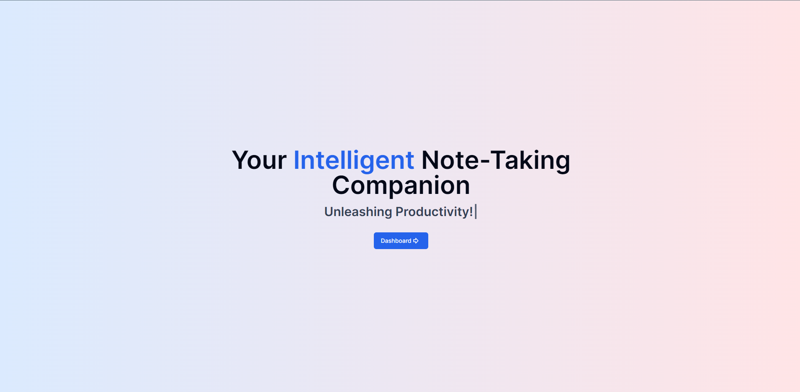
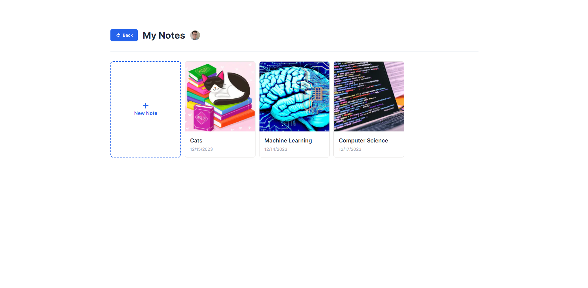

<!-- PROJECT LOGO -->
 

  

<h3 align="center">IntelliJot</h3>

  

    AI-Powered Note App
     
    <a href="https://intellijot.vercel.app"><strong>intellijot.vercel.app</strong></a>
     
     
  

<!-- ABOUT THE PROJECT -->
## About The Project

Note-taking web app that uses the power of AI! Create a note and it will generate you an image for the cover based on the name of your note.
Are you having trouble expanding on an idea or wording it? You can use AI to generate text with a click of a key!

(<a href="#readme-top">back to top</a>)

### Built With

 

* Used Neondb for the Postgres database.
* Tiptap library for the text editor.
* OpenAI API for the text autocomplete and AI cover image features.

(<a href="#readme-top">back to top</a>)

## Features
### AI Text Autocomplete
### AI Image Generation for Note Cover

<!-- USAGE EXAMPLES -->
## Usage
